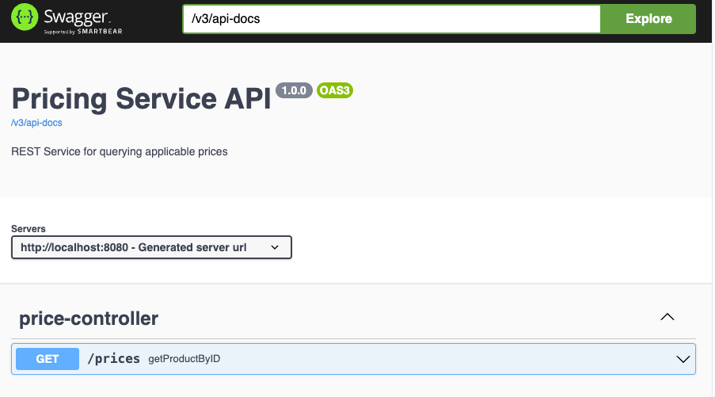
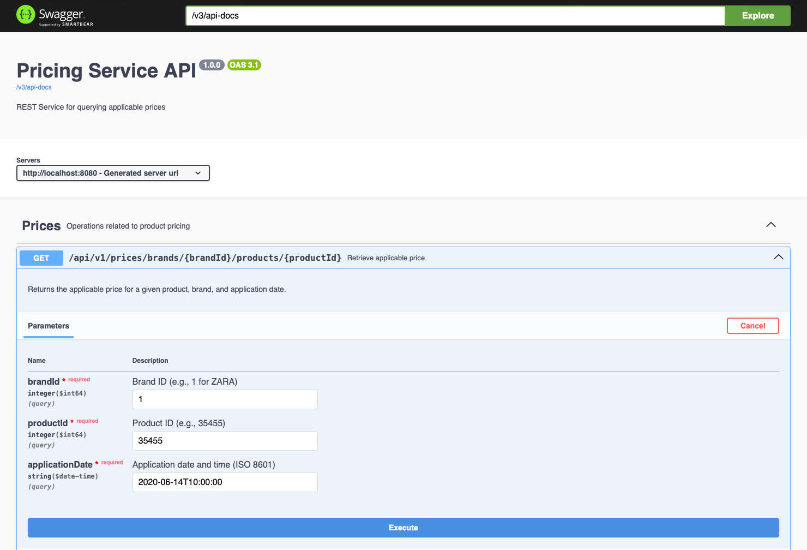
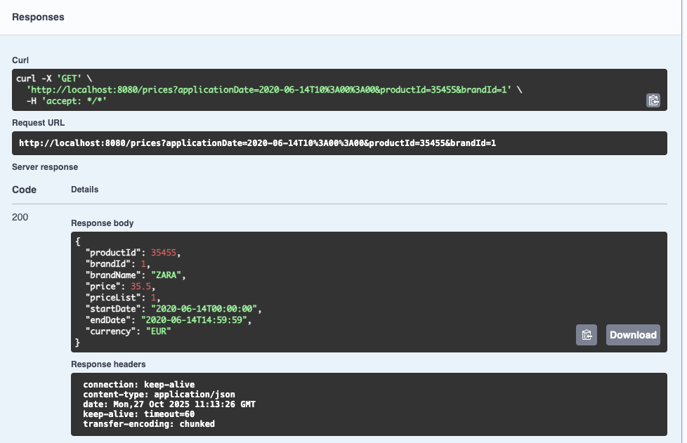
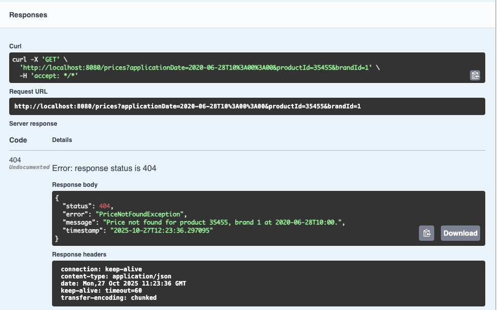
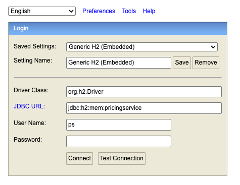
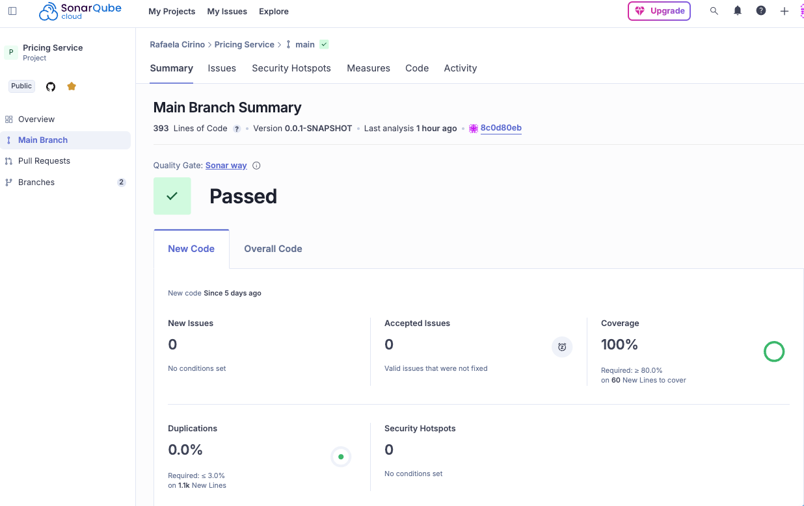

# GET endpoint with good practices

```text
This project meets the following client and test criteria:

- Efficient data extraction: The SQL query uses indexed fields, filters by date range, and selects only the highest priority price using `ORDER BY priority DESC LIMIT 1`.
- GET endpoint with best practices: The API uses a RESTful GET method with path and query parameters, no request body, and clear Swagger documentation. Responses follow HTTP standards (200 OK, 404 Not Found).
```

---

## 📊 Project Status
[](https://github.com/rafaelacirino/pricing-service/actions/workflows/ci.yml)
[](https://sonarcloud.io/summary/new_code?id=rafaelacirino_pricing-service)

---

## Technical Test Requirements

This project fulfills all the requirements outlined in the technical test:

- ✅ REST API with a single GET endpoint
- ✅ Accepts `applicationDate`, `productId`, and `brandId` as query parameters
- ✅ Returns: product ID, brand ID, brand name, price list, start/end dates, final price, and currency
- ✅ Uses in-memory H2 database initialized with sample data
- ✅ Applies pricing logic based on date range and priority
- ✅ Returns only one applicable price per query
- ✅ Includes integration tests for 5 specific scenarios
- ✅ Follows Hexagonal Architecture
- ✅ Clean code with SOLID principles
- ✅ Proper exception handling and error responses
- ✅ Git version control and CI/CD pipeline
- ✅ SonarCloud integration for code quality
- ✅ README with full documentation

---

## Architecture Overview

This project is structured using **Hexagonal Architecture**:

- **Inbound Adapter**: `PriceController`
- **Application Layer**: `PriceService`, `GetPriceUseCase`
- **Outbound Port**: `PriceRepositoryPort`
- **Outbound Adapter**: `PriceRepositoryAdapter`
- **Persistence Layer**: `PriceRepository`, `PriceEntity`
- **Domain Model**: `Price`, `Money`

---

## Technologies Used

- [Java 21](https://openjdk.org/projects/jdk/21/) — Latest LTS version used for compilation
- [Spring Boot 3.5.6](https://spring.io/projects/spring-boot) — Framework for building production-ready applications
- [Spring Web](https://docs.spring.io/spring-boot/docs/current/reference/html/web.html) — RESTful web services and controllers
- [Spring Data JPA](https://docs.spring.io/spring-data/jpa/docs/current/reference/html/) — ORM and repository abstraction
- [H2 Database](https://www.h2database.com/html/main.html) — In-memory database for testing and development
- [Lombok](https://projectlombok.org/) — Reduces boilerplate code with annotations
- [SpringDoc OpenAPI](https://springdoc.org/) — Auto-generates Swagger UI for API documentation
- [JUnit 5](https://junit.org/junit5/) — Unit testing framework
- [Mockito](https://site.mockito.org/) — Mocking framework for unit tests
- [MockMvc](https://docs.spring.io/spring-framework/docs/current/reference/html/testing.html#spring-mvc-test-framework) — Simulates HTTP requests in integration tests
- [JaCoCo](https://www.jacoco.org/jacoco/) — Code coverage reports for tests
- [SonarCloud](https://sonarcloud.io/) — Continuous inspection of code quality and security
- [GitHub Actions](https://docs.github.com/en/actions) — CI/CD pipeline for automated builds and tests 

---

## How to Run Locally

1. Clone the repository:
   ```bash
   git clone https://github.com/rafaelacirino/inditex-pricing-service.git
   cd inditex-pricing-service
2. Run the application using Maven:
   ```bash
    ./mvnw spring-boot:run
3. Access the following resources:
- Swagger UI: http://localhost:8080/swagger-ui.html
- H2 Console: http://localhost:8080/h2-console
- JDBC URL: jdbc:h2:mem:pricingservice
- Username: ps
- Password: (leave blank)

---

## Application Configuration (`application.yml`)

The application is configured using `application.yml` with **clear comments in English**.

### Key Configuration Highlights:

| Feature | Configuration | Purpose                                    |
|--------|---------------|--------------------------------------------|
| **H2 In-Memory DB** | `jdbc:h2:mem:pricingservice` | Isolated, fast, auto-initialized           |
| **Secure Credentials** | `username: ps`, `password: pricing1234` | Avoids default/empty password              |
| **Schema & Data Init** | `spring.sql.init.mode=embedded` | Loads `schema.sql` + `data.sql` on startup |
| **No DDL Auto** | `spring.jpa.hibernate.ddl-auto=none` | Prevents conflicts with `schema.sql`       |
| **Fail Fast on SQL Error** | `continue-on-error: false` | Ensures data integrity                     |
| **Cache** | `spring.cache.type=caffeine` | Improves performance on repeated queries   |
| **Swagger UI** | `springdoc` enabled | Full API documentation                     |
| **Logging** | File + structured levels | Debuggable in production                   |

> **All properties are commented in the file** to explain **why** they exist — essential for maintainability and evaluation.
---

## Testing

Unit tests cover the core business logic and adapters, for example:

- **PriceServiceTest**: validates price selection logic

- **PriceRepositoryAdapterTest**: ensures correct mapping and priority handling

- **PriceControllerTest**: verifies controller behavior and error handling

#### Run tests with:
1. To execute all unit and integration tests, use:
    ```bash
    ./mvnw test

Integration Tests

Integration tests validate the full request-response cycle using `MockMvc`. These tests simulate HTTP requests to the `/prices` endpoint and verify the expected behavior based on the initialized H2 data.

The following test cases are implemented:

| Test Case | Date & Time         | Product ID | Brand ID | Expected Status | Expected Price List | Expected Price |
|-----------|---------------------|------------|----------|------------------|----------------------|----------------|
| Test 1    | 2020-06-14 10:00    | 35455      | 1 (ZARA) | 200 OK           | 1                    | 35.50 EUR      |
| Test 2    | 2020-06-14 16:00    | 35455      | 1 (ZARA) | 200 OK           | 2                    | 25.45 EUR      |
| Test 3    | 2020-06-14 21:00    | 35455      | 1 (ZARA) | 404 Not Found    | —                    | —              |
| Test 4    | 2020-06-13 10:00    | 35455      | 1 (ZARA) | 404 Not Found    | —                    | —              |
| Test 5    | 2020-06-16 21:00    | 35455      | 1 (ZARA) | 200 OK           | 4                    | 38.95 EUR      |

Each test verifies:

- Correct selection of price based on date range
- Priority handling when multiple prices overlap
- Proper error response when no price is applicable

You can find these tests in the class:  
`src/test/java/com/cirino/rafaela/inditex/pricingservice/infrastructure/adapter/inbound/PriceControllerIntegrationTest.java`

---

## Screenshoots

Visual documentation and screenshots of the Swagger UI, H2 Console, and test results.
* Swagger UI



* Swagger Request



* Swagger Response OK



* Swagger Response 404



* H2 Connection





* H2 Table / Data


* Code Coverage


---

## Project Structure

```text
src/
├── main/
│   ├── java/
│   │   └── com/cirino/rafaela/inditex/pricingservice/
│   │       ├── application/                 # Application layer: coordinates use cases and business orchestration
│   │       │   ├── dto/                     # Mapping utilities between model and DTO
│   │       │   ├── mapper/                  # Data Transfer Objects for input/output
│   │       │   ├── ports/
│   │       │   │   ├── inbound/             # Interfaces defining use cases exposed to external layers
│   │       │   │   └── outbound/            # Interfaces defining interactions with external systems (e.g., repositories)
│   │       │   └── service/                 # Implementations of use cases and business logic
│   │       ├── domain/                      # Domain layer: encapsulates core business rules and entities
│   │       │   ├── exception/               # Custom domain exceptions
│   │       │   └── model/                   # Domain models (e.g., `Price`, `Money`)
│   │       ├── infrastructure/              # Infrastructure layer: handles technical and external integrations
│   │       │   ├── adapter/                 # Optional: shared adapter logic or legacy integrations
│   │       │   │   ├── inbound/             # Adapters for incoming requests (e.g., REST controllers) 
│   │       │   │   └── outbound/            # Adapters for external systems (e.g., database, APIs)
│   │       │   ├── config/                  # Spring Boot configuration classes
│   │       │   └── persistence/             # Data access layer implementations
│   │       │   │   ├── entity/              # JPA entities mapped to database tables (e.g., `PriceEntity`)
│   │       │   │   ├── mapper/              # Mapping utilities (e.g., MapStruct) between entities and DTOs
│   │       │   │   └── repository/          # Repository interfaces for data access
│   └── resources/
│       ├── assets/                          # Screenshots or supporting documentation images
│       ├── application.yml                  # Spring Boot configuration file
│       ├── data.sql                         # Initial data for the H2 in-memory database
│       └── schema.sql                       # Database schema definition
└── test/
    └── java/com/cirino/rafaela/inditex/pricingservice
        ├── application/                     # Unit tests for service layer
        ├── domain/                          # Unit tests for domain models and logic
        └── infrastructure/                  # Unit and integration tests for controller
```

## Version Control 
- Conventional Commits: `feat:`, `docs:`, `test:`, `refactor:` for clear history.
- Latest commits standardized for evaluation (e.g., "docs: finalize README...").
- Tag: v1.0.0 for final delivery.

## 👩‍💻 Author:

**Rafaela Cirino**

Software Engineer | Java | Spring Boot | Hexagonal Architecture

🔗 [LinkedIn](https://linkedin.com/in/rafaelacirino)  
🔗 [GitHub](https://github.com/rafaelacirino)